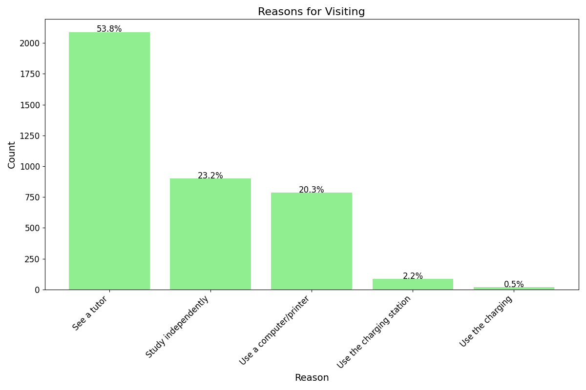
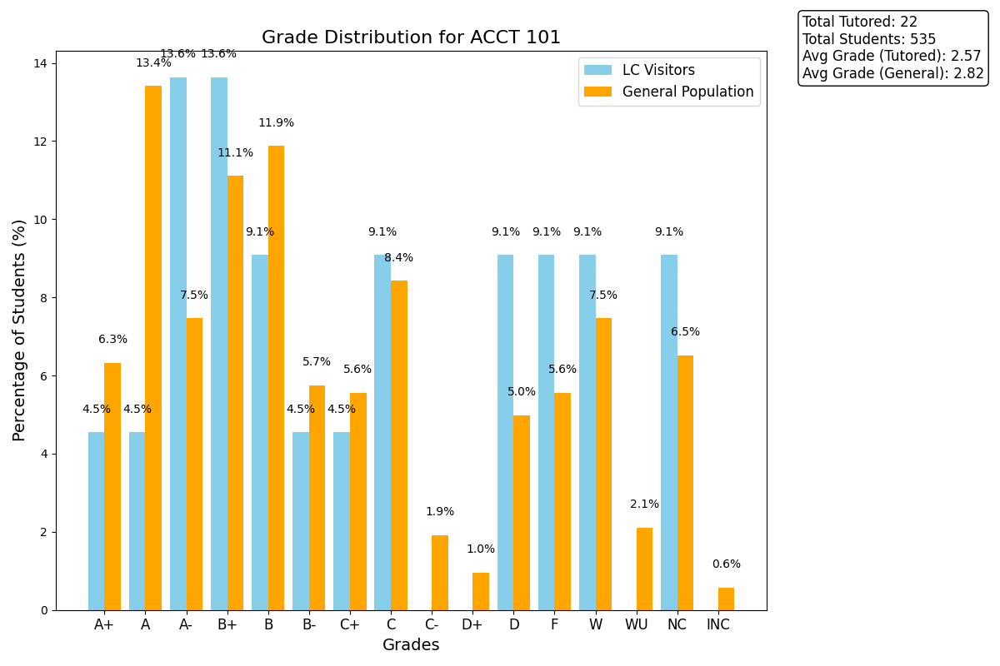

# **QCLC Data Analyzer**

This repository contains scripts and example outputs for cleaning up tutoring center data and generating charts/graphs to analyze trends at the [**Queens College Learning Commons (QCLC)**, or your institution’s tutoring center]. The project is broken into **data-cleanup** scripts and **graph-generation** scripts, plus a **combined roster** workflow.

## **Table of Contents**
1. [Project Overview](#project-overview)
2. [Data Flow](#data-flow)
3. [Scripts](#scripts)
   - [Data Cleanup Scripts](#data-cleanup-scripts)
   - [Roster Combination](#roster-combination)
   - [Course Validation](#course-validation)
   - [Graph Generation](#graph-generation)
4. [Usage](#usage)
5. [Example Outputs](#example-outputs)
6. [Contributing](#contributing)
7. [License](#license)

---

## **Project Overview**
The **QCLC Data Analyzer** automates much of the data cleanup and analysis needed to ensure accurate records of tutoring sessions, then produces a variety of charts to help visualize patterns—such as **walk-ins vs. appointments**, **top frequent visitors**, **tutor workloads**, and **grade distributions** of tutored vs. non-tutored students.

---

## **Data Flow**
1. **Check-In Form**: 
   - A spreadsheet (`check_in_form.xlsx`) containing students’ first/last names, IDs, and the courses they received tutoring for.
2. **All Enrolled Spreadsheet**: 
   - A spreadsheet listing all enrolled students, used to flag mismatches in student names/IDs.
3. **Multiple Grade Rosters**:
   - Individual rosters (e.g., `FA24 MATH Grade Roster.xlsx`, `FA24 CSCI Grade Roster.xlsx`) that show each student’s enrolled classes and final grades.
4. **Combined Roster**:
   - A single, merged spreadsheet of all rosters (`Combined_Roster.xlsx`) for easier data matching.
5. **Cleaned-Up Data**:
   - The final check-in form after removing errors and mismatches.
6. **Graphs/Charts**:
   - Scripts that read the cleaned-up data and produce visual analyses.

---

## **Scripts**

### **Data Cleanup Scripts**
1. **`Data_cleanup_1.py` and `Data_cleanup_2.py`**  
   - Compare the check-in form with the “all enrolled” spreadsheet to catch discrepancies in names or IDs.  
   - Flag rows that need manual review.

2. **Manual Cleanup**  
   - **Important**: After each cleanup script, a human must review flagged rows and correct them by checking the official student info portal (CUNYfirst).  

### **Roster Combination**
- **`Combine_roster.py`**  
  - Combines all subject-specific grade rosters into a single file, `Combined_Roster.xlsx`.  
  - Uses `glob` to loop through all `.xlsx` files in a specified folder and concatenates them.

### **Course Validation**
- **`Data_cleanup_3_course_validation.py`**  
  - Uses the newly created `Combined_Roster.xlsx` to verify that each student who signed up for a course is actually enrolled in that course.  
  - Flags rows in the check-in form if a student is not found in the combined roster for that course.

### **Graph Generation**
Within the **`Generate graphs`** folder, you’ll find multiple scripts, each generating specific insights from the **cleaned-up data**:

1. **`Walk-ins_vs_appointments.py`**  
   - Compares what percentage of tutees made appointments vs. walk-ins.
2. **`Tutor_assistance_average_weekly.py`**  
   - Shows a bar chart of the average number of students each tutor helped per week.
3. **`Top_30_frequent_visitors.py`**  
   - Displays a bar chart of the top 30 students who visit the Learning Commons most frequently.
4. **`Grade_distribution.py`**  
   - Uses the cleaned check-in form and `Combined_Roster.xlsx` to generate grade distribution graphs for every class. Compares **LC visitors**’ grades vs. **general student population**’s grades for that class.
5. **(More scripts)**  
   - Additional scripts for generating various bar/pie charts, such as **Reasons for Visiting**, **Courses/Majors Assisted**, etc.

---

## **Usage**
1. **Clone the Repo**  
   ```bash
   git clone https://github.com/matteoSaputo/QCLC-Data-Analyzer.git
   ```
2. **Set Up Python Environment**  
   - Use `pip install -r requirements.txt` if you have a requirements file. Otherwise, ensure `pandas`, `openpyxl`, `matplotlib`, etc., are installed.
3. **Run Data Cleanup**  
   - Place your check-in form (`check_in_form.xlsx`), all enrolled spreadsheet, and rosters in the appropriate folders.  
   - Run `Data_cleanup_1.py`, manually fix flagged rows, then run `Data_cleanup_2.py`, etc.
4. **Combine Rosters**  
   - Run `Combine_roster.py` to create `Combined_Roster.xlsx`.
5. **Final Course Validation**  
   - Run `Data_cleanup_3_course_validation.py` to verify students are enrolled in the classes they’re signing up for.
6. **Generate Graphs**  
   - Move to the `Generate graphs` folder (optional) and run the scripts you need (e.g., `python Walk-ins_vs_appointments.py`).
   - Resulting PNG charts are saved to `Relevant_graphs/`.

---

## **Example Outputs**
Below are some example graphs generated by the scripts in this project.
> **Note**: The `Relevant_graphs/` and `Grade_distributions/` folders in this repo contain **example charts** generated from sample data. If you plan to run these scripts with your own data, you may want to **delete or move** these example outputs first to avoid mixing them with new results.

### **Reasons for Visiting**
Here’s a sample bar chart showing the percentage of students who came to utilize different services:



### **Grade Distribution (ACCT 101)**
This bar graph compares the grades of ACCT 101 students who visited the Learning Commons vs. the general class:



---

## **Contributing**
1. **Fork** the repo and create a feature branch.
2. **Commit** your changes.
3. **Open a Pull Request** on GitHub.

---

## **License**
This project is licensed under the [MIT License](LICENSE) (or whichever license you prefer).

---

### **Questions or Issues?**
Feel free to open an [Issue](https://github.com/matteoSaputo/QCLC-Data-Analyzer/issues) on GitHub or reach out directly! 

Happy analyzing! 🎉
